# UI bank — layout and component patterns for the Catan client

A catalogue of vanilla HTML/CSS patterns sized for *this* game: a canvas board
that must dominate the screen, a ~17-rule lobby, a Cities & Knights rail, trade
offers with countdowns, and a log that has to stay readable while it grows.

Nothing here is wired into the app. Every file is a standalone page under
`patterns/`, and `patterns/tokens.css` is the only thing they share. Adopt a
pattern by copying its `<style>` block and its markup.

## Status of every pattern

Each pattern was rendered in headless Chromium at three viewports, the PNG was
opened and looked at, and the page was asserted for (a) no horizontal page
overflow, (b) no element overflowing a box that cannot scroll, (c) WCAG AA
contrast on every piece of rendered text (4.5:1, or 3:1 for large text).

| Pattern | File | 1920×1080 dark | 1366×768 light | 900×1400 dark |
|---|---|---|---|---|
| Design tokens | `tokens.html` | pass | pass | pass |
| Shell A — rail / board / aside | `shell-a-rail-board-aside.html` | pass | pass | pass |
| Shell B — full-bleed board + HUD | `shell-b-hud-overlay.html` | pass | pass | pass |
| Rule selector | `rules-panel.html` | pass | pass | pass |
| Player scoreboard | `scoreboard.html` | pass | pass | pass |
| Resource hand & bank | `resource-hand.html` | pass | pass | pass |
| Cards & countdowns | `cards-and-timers.html` | pass | pass | pass |
| Modal dialogs | `modals.html` | pass | pass | pass |
| Event log & chat | `log-and-chat.html` | pass | pass | pass |
| Notices & banners | `banners.html` | pass | pass | pass |
| Cities & Knights panels | `cities-knights.html` | pass | pass | pass |

Re-run the whole thing from the repo root:

```
.venv/bin/python ui-bank/tools/check.py            # everything
.venv/bin/python ui-bank/tools/check.py modals.html  # one page
```

Screenshots land in `ui-bank/screenshots/<pattern>--<viewport>.png` and are
committed as the evidence.

Themes are split across the viewport rows rather than doubling every render:
1920 and 900 are dark, 1366 is light. Both themes are therefore covered for
every pattern, but no pattern has been seen at *every* combination of theme and
width. See "What is not verified" at the bottom.

---

## Recommendation for this game

**Use Shell A.** Ranking:

1. **Shell A — rail / board / aside.** Closest to the shape the app already
   has (`.game-rail` + `.game-main` + `.table-aside`), so adopting it is a CSS
   change rather than a rewrite. Panels never overlap the board, all three
   regions are legible at 1366×768, and the board still gets ~730×620 of a
   1366 laptop. It is the only one of the two that degrades to a plain
   scrolling document on a phone without losing a control.
2. **Shell B — full-bleed board + HUD.** Better looking, and the board is
   genuinely larger — but the cards eat four corners of the play area, the
   translucent surfaces can only *approximately* promise contrast over an
   arbitrary canvas, and the narrow layout needs JS to measure the clear band
   before the board can be drawn in it. Worth revisiting as a "focus mode"
   toggle on top of Shell A rather than as the default.

Take from Shell B regardless: the floating board status pill and the zoom
cluster overlaying the board instead of pushing it. Anything that appears
mid-turn and changes the board box forces a drawing-buffer reallocation.

### The dead space below the board

The blank band under the board is not a spacing bug, it is the canvas's
intrinsic size showing through. A `<canvas>` with no `width`/`height`
attributes is 300×150 and behaves like a replaced element: it contributes that
aspect to layout, the browser letterboxes it inside whatever box it is given,
and the difference is the dead space. Three rules fix it, all three needed:

```css
/* 1 — the board's container is the ONLY greedy track in the column. */
.stage {
    display: grid;
    grid-template-rows: minmax(var(--shell-min-board), 1fr) auto;  /* board | console */
    min-height: 0;   /* without this the row sizes to content and the PAGE scrolls */
}

/* 2 — the box has a real height and clips. */
.board { position: relative; overflow: hidden; min-height: 0; }

/* 3 — the canvas is taken out of flow, so it can never impose a size. */
.board__canvas { position: absolute; inset: 0; width: 100%; height: 100%; }
```

and the buffer is then derived from the box rather than the other way round:

```js
new ResizeObserver(() => requestAnimationFrame(draw)).observe(box);

function draw() {
    const w = box.clientWidth, h = box.clientHeight;
    const dpr = window.devicePixelRatio || 1;
    canvas.width = Math.round(w * dpr);
    canvas.height = Math.round(h * dpr);
    ctx.setTransform(dpr, 0, 0, dpr, 0, 0);   // drawing units are CSS pixels
    // ...
}
```

The board is then always exactly as tall as the space left over, and there is
no band under it to be blank. The current `--table-height:
clamp(30rem, calc(100vh - 10rem), 58rem)` can go: with `min-height: 0` on the
shell row, `100dvh` on `<body>` and `1fr` on the board track, the height falls
out of the layout instead of being guessed.

Two follow-on notes: use `100dvh`, not `100vh`, or mobile browser chrome hides
the console; and put mid-turn indicators (robber prompt, free-roads counter)
*over* the board with `position: absolute`, not above it, so they do not
re-trigger the ResizeObserver and reallocate the buffer every time a 7 is
rolled.

---

## The patterns

### 1 · Design tokens — `patterns/tokens.css`, demo `patterns/tokens.html`

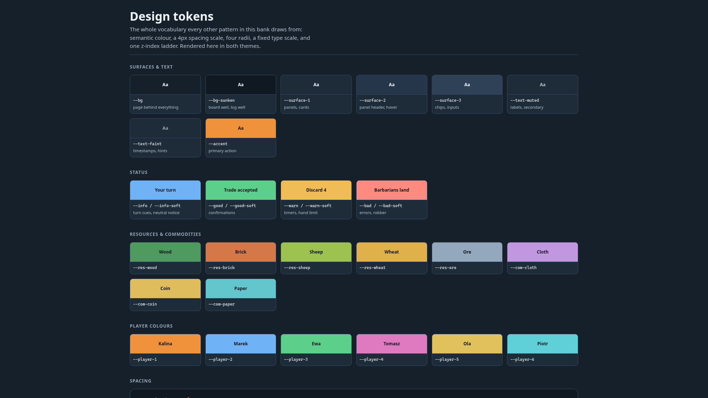
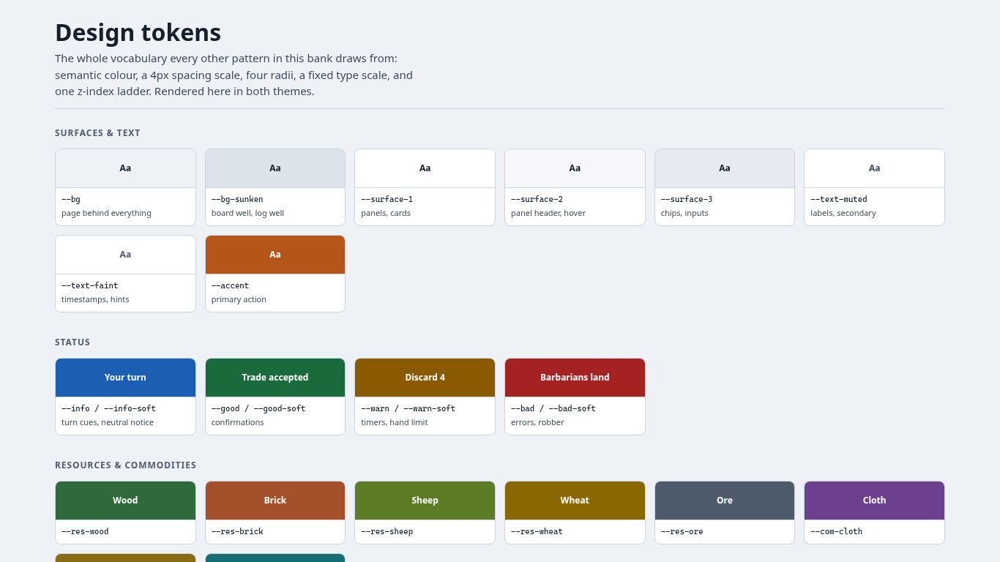

Semantic colour, a 4px spacing scale, four radii, a fixed type scale, one
z-index ladder, and motion durations that are collapsed by
`prefers-reduced-motion` at the bottom of the file — so anything transitioning
via `var(--dur-*)` honours the preference for free.

**Use it** as the single import for anything adopted from this bank. **Do not**
add a literal colour to a pattern; if a shade is missing, add a semantic token.

Three things worth knowing before reusing the palette:

- **Themes are declared three times.** Light on `:root`, dark under
  `prefers-color-scheme`, and both again under `[data-theme]` so a manual
  toggle can override the OS in *either* direction. A new colour token must be
  added to all three blocks or the toggle half-applies.
- **Terrain fills are a separate ramp from resource colours** (`--terrain-*`
  vs `--res-*`). The first version reused one ramp for both and the light-theme
  board came out dark and muddy: `--res-*` carries white text and is darkened
  to hit AA, which is exactly wrong for a large hex fill. Nothing legible is
  ever drawn directly on `--terrain-*` — number tokens sit on their own
  `--surface-1` disc.
- **Player colours are dark enough to be text.** A chat name is coloured text
  on a light panel, not just a filled pip, so the light-theme values were
  darkened until they passed AA both ways.

```css
:root {
    --space-1: .25rem; --space-2: .5rem; --space-3: .75rem;
    --space-4: 1rem;   --space-5: 1.5rem; --space-6: 2rem; --space-7: 3rem;
    --radius-sm: 4px; --radius-md: 8px; --radius-lg: 14px; --radius-pill: 999px;
    --text-2xs: .6875rem; --text-xs: .75rem;  --text-sm: .8125rem;
    --text-md: .9375rem;  --text-lg: 1.0625rem;
    --text-xl: clamp(1.15rem, .9rem + .6vw, 1.4rem);
    --text-2xl: clamp(1.4rem, 1rem + 1.4vw, 2rem);
}
```

Body size is deliberately fixed and only the two heading sizes are fluid — a
fluid body size makes lines in the event log reflow while you are reading them.

**Caveat:** `color-mix()` is used throughout for soft borders and tints. It is
Baseline-2023 (Chrome 111+, Safari 16.2+, Firefox 113+). There is no fallback;
in an older browser those borders compute to nothing and render transparent —
degraded, not broken. If you need to support older, replace each
`color-mix(...)` with a plain token.

---

### 2 · Shell A — rail / board / aside — `patterns/shell-a-rail-board-aside.html`

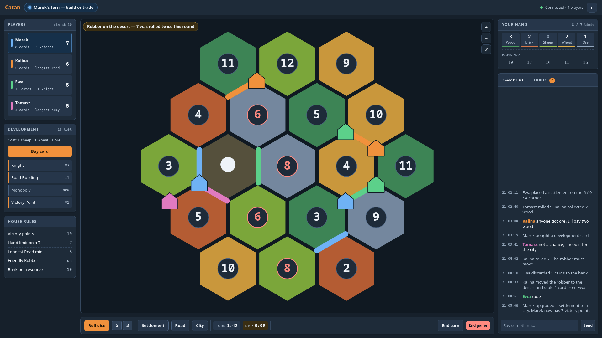
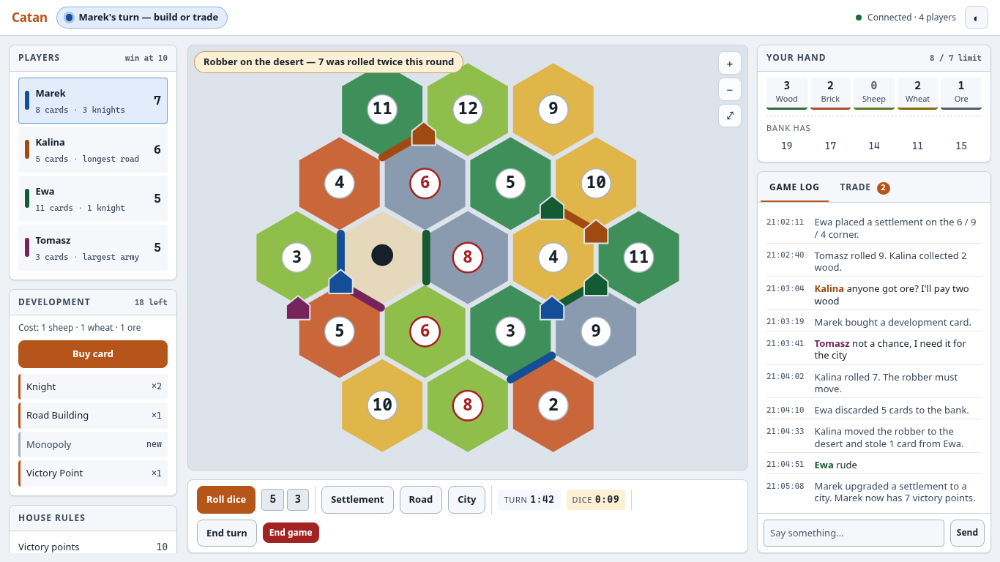
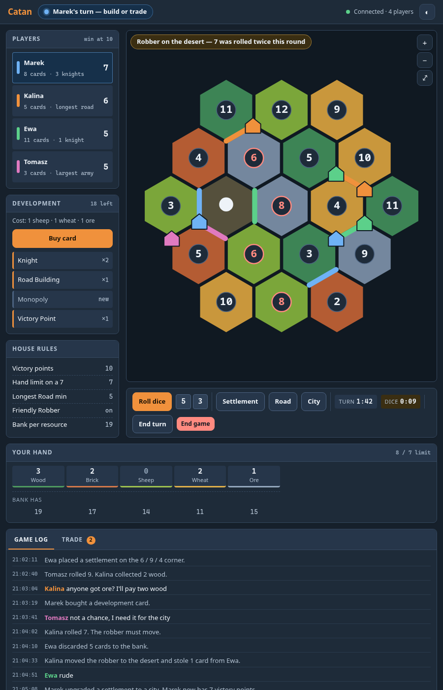

Three viewport-locked columns. The page never scrolls; every variable-length
list scrolls inside its own panel. The board column is the only track that
takes leftover space in both axes.

**Use it** as the default game screen. **Do not** use it below ~820px, where it
folds to a single scrolling column — which the media queries already do.

```css
body { display: grid; grid-template-rows: auto 1fr; height: 100dvh; overflow: hidden; }

.shell {
    display: grid;
    grid-template-columns: var(--panel-rail) minmax(0, 1fr) var(--panel-aside);
    grid-template-areas: "rail board aside";
    gap: var(--space-3);
    min-height: 0;   /* load-bearing: otherwise the page scrolls, not the panels */
    min-width: 0;
}

.stage { display: grid; grid-template-rows: minmax(var(--shell-min-board), 1fr) auto; min-height: 0; }
```

**Caveats, both found by looking at the render rather than the CSS:**

- **Do not give the rail panels flex ratios.** The first version had
  `#panel-players { flex: 3 1 0 }` and friends. It looks tidy in a mockup and
  wrong in practice: a four-player scoreboard sitting in a track sized for six
  leaves a hole *inside* the panel, which reads as a rendering bug. The rail is
  now one scroll column with content-sized panels, so slack falls outside the
  panels where it is just background.
- **The console wraps to two rows at 1366 and below** and the trailing group
  lands left-aligned on the second row because of the flex spacer. It is not an
  overflow and nothing collides, but it is the least tidy thing on the page. If
  it bothers you, drop the spacer below ~1400px.

---

### 3 · Shell B — full-bleed board + floating HUD — `patterns/shell-b-hud-overlay.html`

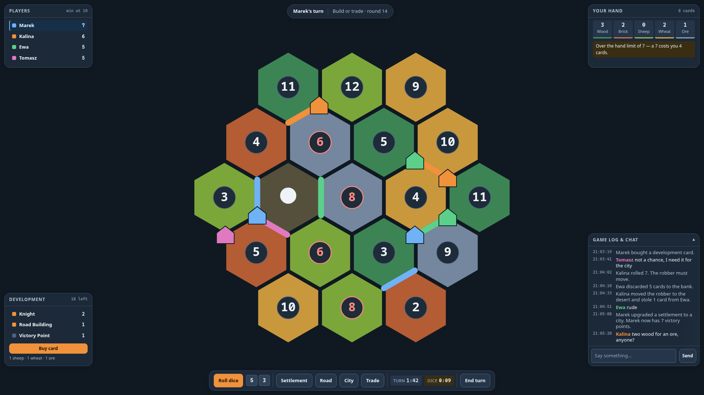
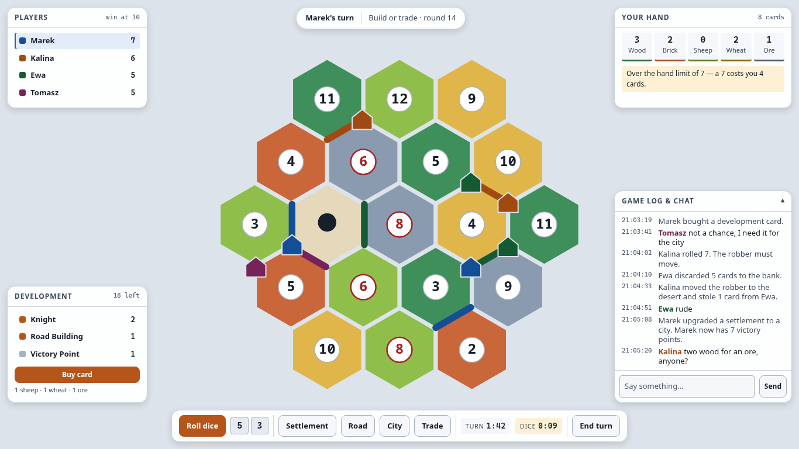
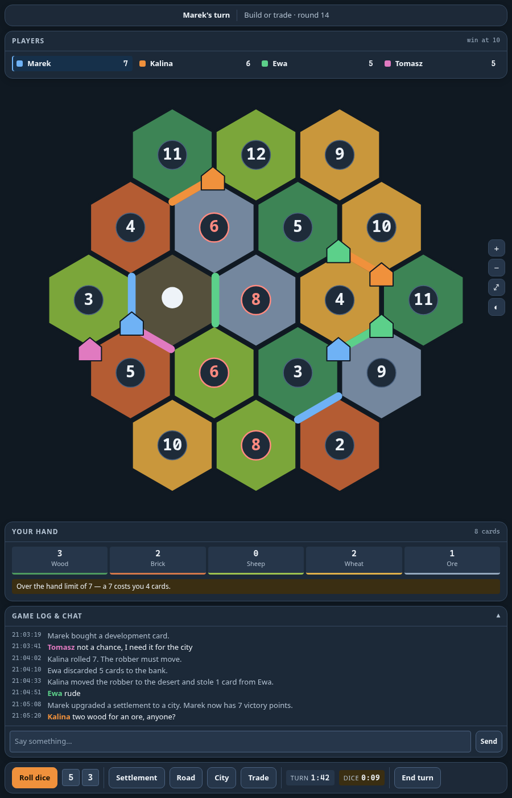

The canvas is the whole viewport; the HUD is a `pointer-events: none` grid laid
over it. Dead space is structurally impossible because there is no box the
board could fail to fill.

**Use it** for a focus/spectator mode, or on a large screen where the corners
are genuinely spare. **Do not** use it as the only layout, and do not use it if
panels need to grow — everything on it has to stay small or collapse.

```css
.hud {
    position: absolute; inset: 0;
    display: grid;
    grid-template-columns: minmax(0, 15rem) minmax(0, 1fr) minmax(0, 19rem);
    grid-template-rows: auto minmax(0, 1fr) auto;
    grid-template-areas: "tl top tr" "bl . cr" "dock dock dock";
    pointer-events: none;      /* or the board becomes undraggable */
}

.hud > * { pointer-events: auto; }
```

**Caveats:**

- **Contrast over a canvas cannot be guaranteed.** Cards are 94% opaque plus a
  blur, which makes it *near* certain, and the contrast check treats them as
  the composited colour. A genuinely glassy 60% card over an arbitrary board
  would be a gamble. If you push transparency further, you are trading a
  measurable guarantee for a look.
- **`<details>` cannot be a stretching flex container.** Chromium wraps
  everything after the `<summary>` in an internal `::details-content` slot, so
  `flex: 1` on the scroll region grows nothing; the card ended up full height
  with the chat box floating in the middle of empty space. The working answer
  is to let the card hug its content, anchor it to the bottom of its column
  (`align-items: end`) and cap the scroll region with `max-height`.
- **Narrow needs JS.** The board is centred in the band measured between the
  top strip and the bottom sheet. A guessed fraction left it floating with dead
  bands above and below — the very problem the shell exists to avoid.
- **The first narrow version hid the action dock and the log outright.** It
  screenshotted beautifully and was unplayable. Never drop a control on a small
  screen; move it. The dock now scrolls horizontally instead.
- The development panel *is* dropped below 900px — it is the one panel whose
  contents are also reachable from the dock's Buy button.

---

### 4 · Rule selector — `patterns/rules-panel.html`

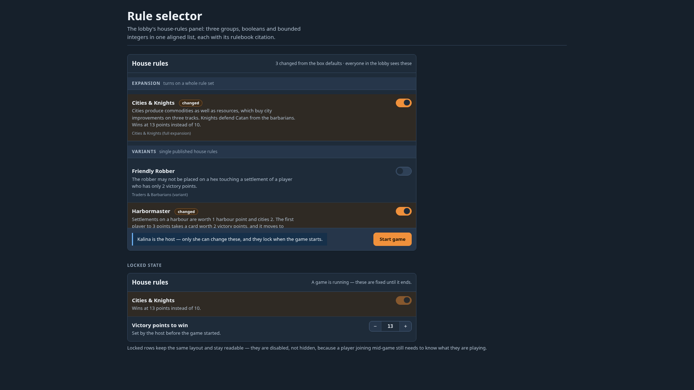
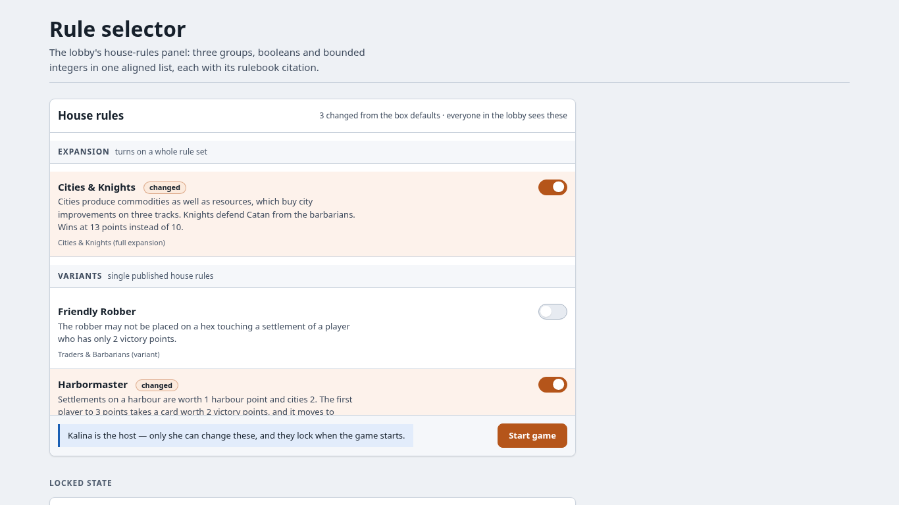
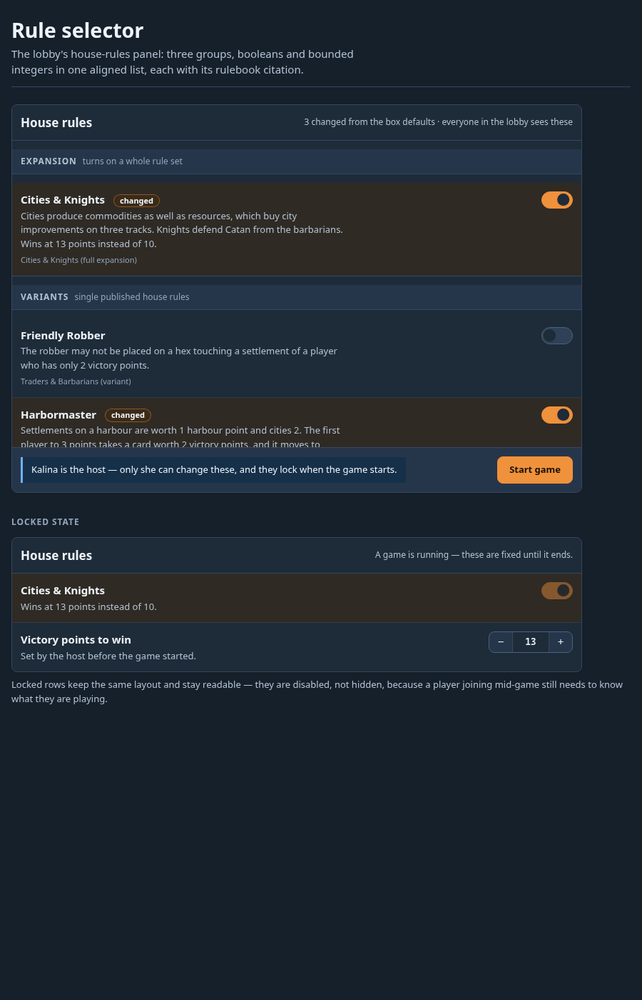

The lobby's house-rules panel, built for the shape `server/game/rules.py`
actually produces: three groups (`core` / `expansion` / `variant`), booleans
and bounded integers mixed, each rule carrying a name, a summary and a `source`
citation.

**Use it** anywhere a list of heterogeneous settings needs to stay scannable.
**Do not** use it for two or three settings — the sticky group headers and the
scroll region are overhead you do not need.

Two decisions carry it. One row template for both control types, so the
name/summary column stays aligned down the whole list; and the summary and
citation are always visible, never a tooltip — "is that really the official
rule?" is the question this panel exists to answer, and a tooltip answers it
for nobody on a touch screen.

```css
.rule {
    display: grid;
    grid-template-columns: minmax(0, 1fr) auto;  /* description | control */
    align-items: start;
}

/* Progressive enhancement only: the checkbox is still the state. */
.rule:has(input[type="checkbox"]:checked) {
    background: color-mix(in srgb, var(--accent-soft) 60%, transparent);
}
```

**Caveats:**

- **`:has()` is decoration here, on purpose.** A browser without it (anything
  before ~2023) shows an untinted but fully working row. Do not move real state
  into a `:has()` rule.
- **Width is capped at 50rem.** Left to fill a 1920px lobby, the switch ends up
  so far from the rule it belongs to that the eye cannot connect them.
- The switch is a restyled `<input type="checkbox">`, not a div with a click
  handler, so Space toggles it and it serialises with a form. The stepper hides
  the native spinners (they duplicate the buttons and cannot be hit on touch)
  but the `<input type="number">` is real, so typing and arrow keys still work.

---

### 5 · Player scoreboard — `patterns/scoreboard.html`

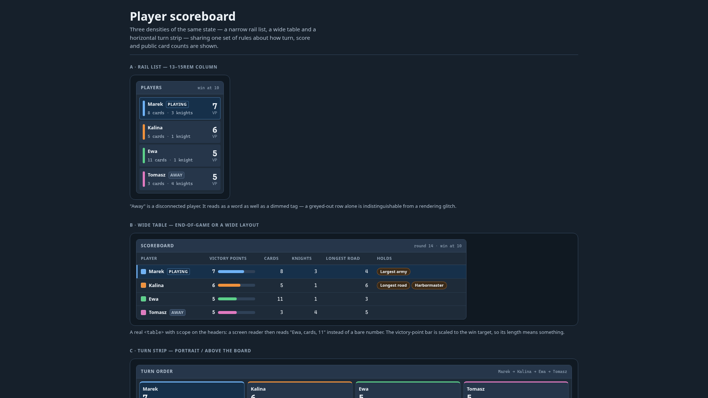
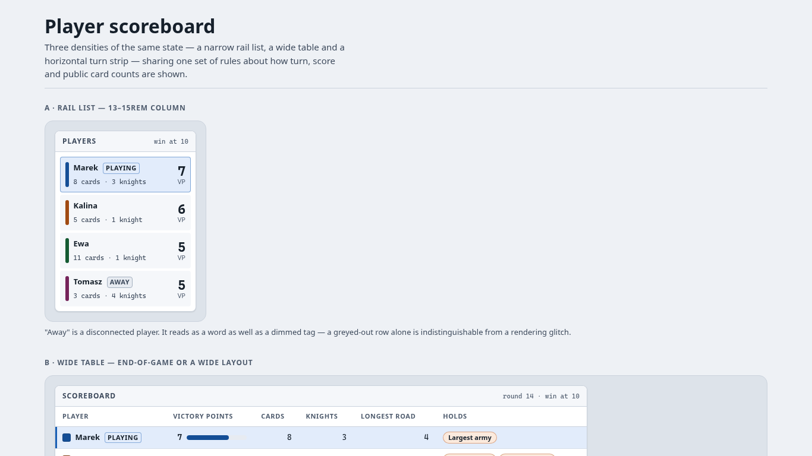
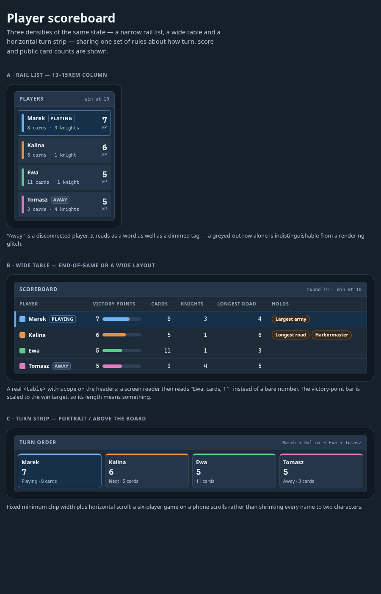

Three densities: a rail list for a 13–15rem column, a real `<table>` for a wide
layout or the end-of-game screen, and a horizontal turn strip for portrait.

**Use** the rail list in Shell A's rail, the table for game-over, the strip
above the board on a phone. **Do not** use the table in a narrow column — it
has six columns and will either wrap into mush or force a horizontal scroll.

Rules shared by all three: turn is never signalled by colour alone (the current
player gets a filled bar *and* the word "Playing", because every player already
owns a colour); "Away" is a word as well as a dimmed tag, since a greyed-out row
alone is indistinguishable from a rendering glitch; and every number is tabular
so a score ticking 9 → 10 does not shift the column.

```css
/* The victory-point bar is scaled to the win target, not to a percentage,
   so its length means something. */
.vp-bar { display: grid; grid-template-columns: 2ch minmax(4rem, 1fr); }
.vp-bar__fill { display: block; height: 100%; background: var(--pc); }
```

**Caveat — the one bug worth repeating:** `display: block` on `.vp-bar__fill` is
load-bearing. It is a `<span>` whose parent is not a flex or grid container, so
without it the element stays inline, `width` and `height` are ignored, and every
bar renders as an empty grey track. The same mistake was present in the bank
supply bars and the countdown bars. It passes every automated check — only
looking at the picture catches it.

---

### 6 · Resource hand & bank — `patterns/resource-hand.html`

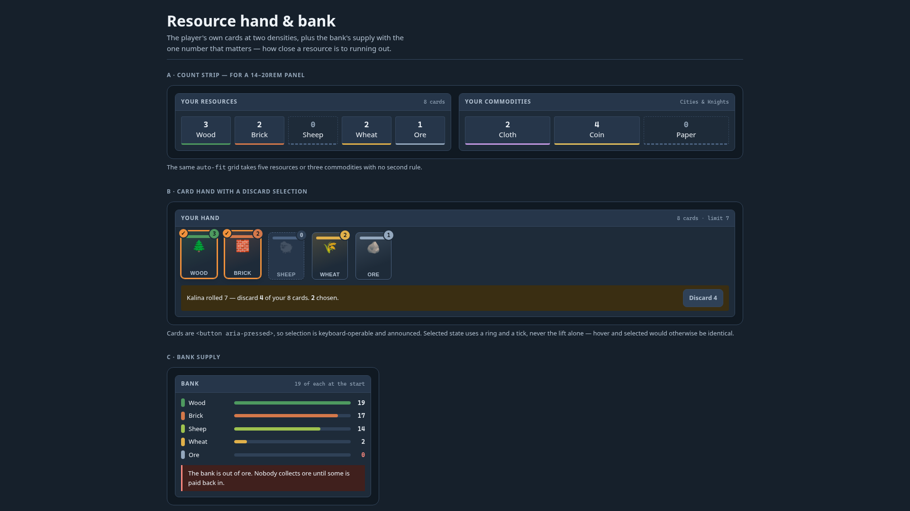
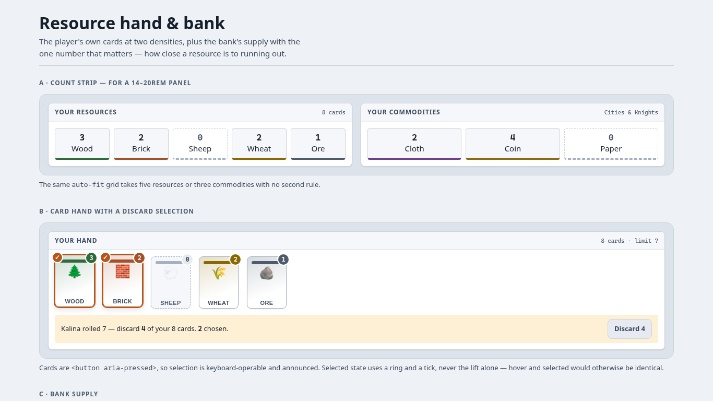
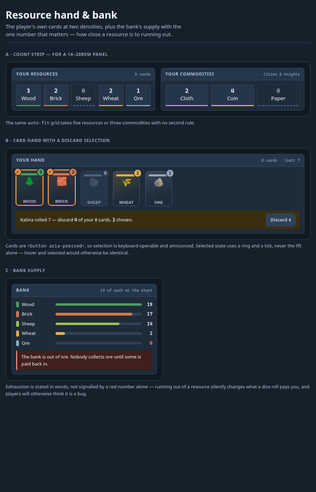

A compact count strip, a selectable card hand for discards, and a bank panel
with a supply bar.

**Use** the count strip in any panel from 14rem up — the same `auto-fit` grid
takes five resources or the three Cities & Knights commodities with no second
rule. **Use** the card hand only where individual cards are chosen (discard on
a 7, Year of Plenty). **Do not** use the card hand as the standing display; it
is four times the height for the same information.

Resource identity is carried by a colour band *and* the resource name, always
both. The app's current emoji (🌲🧱🐑🌾🪨) renders differently on every
platform, is announced as "deciduous tree" by a screen reader, and gives a
colour-blind player nothing extra — so here it is `aria-hidden` decoration and
the word is the label.

The bank panel's point is `17 of 19`, not `17`. Exhaustion is stated in a
sentence, because running out of a resource silently changes what a dice roll
pays you and players will otherwise report it as a bug.

**Caveats:**

- **Never use `opacity` for an empty or disabled state.** It fades the text
  along with the box and takes it below AA every time — it cost three separate
  fixes across this bank. Mute specific tokens instead, and reserve `opacity`
  for `aria-hidden` decoration. (This also means the automated check must fold
  ancestor opacity into the text colour; the first version skipped faded
  elements and therefore excused exactly the cases that were worst.)
- **The card gap is sized by the badges, not by taste.** The count pill and the
  selection tick each hang ~7px outside the card, so anything under ~16px of
  gap makes one card's count collide with the next card's tick.
- Cards are `<button aria-pressed>`, so selection is keyboard-operable and
  announced, and selected state uses a ring and a tick — never the hover lift
  alone, or hover and selected look identical.

---

### 7 · Cards & countdowns — `patterns/cards-and-timers.html`

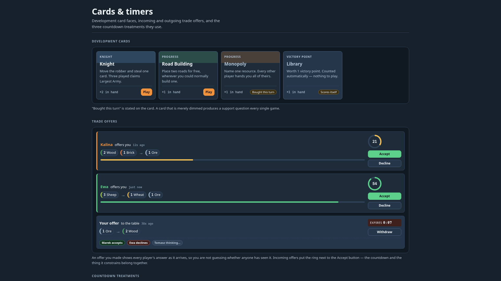
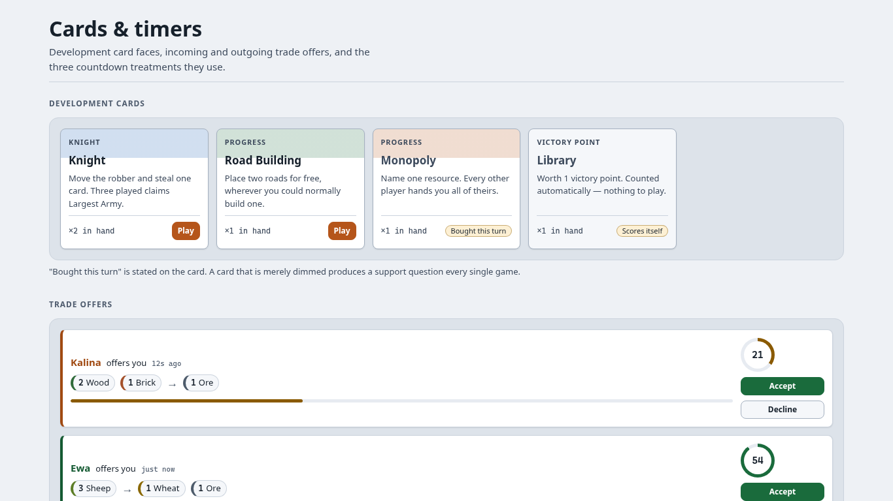
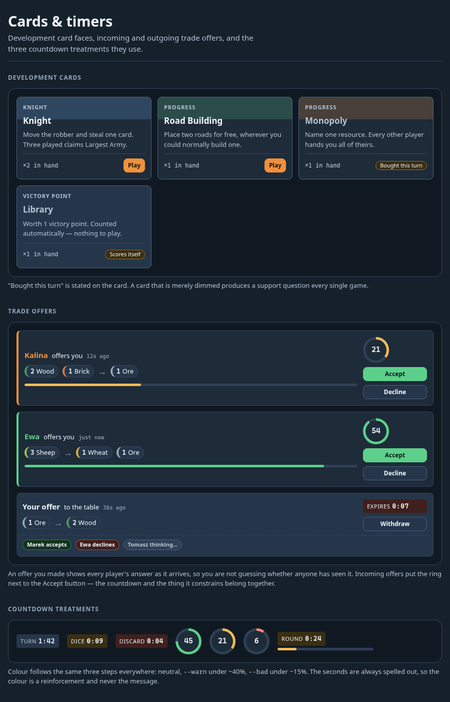

Development card faces, incoming and outgoing trade offers, and three countdown
treatments (pill, depleting bar, conic ring).

**Use** the pill by default — it is two lines of CSS, always legible and has no
motion at all. **Use** the ring where the countdown must sit next to the thing
it constrains (an Accept button). **Do not** use the ring anywhere the seconds
are not also printed inside it.

```css
/* Ring: conic-gradient, no SVG, no library. --left is written once a second. */
.timer-ring {
    background: conic-gradient(var(--ring) calc(var(--left, 1) * 360deg), var(--surface-3) 0);
    transition: background 1s linear;
}

/* Bar: one CSS transition, not a rAF loop — six live offers must not run six loops. */
.timer-bar__fill { display: block; width: calc(var(--left, 1) * 100%); transition: width 1s linear; }

@media (prefers-reduced-motion: reduce) {
    .timer-bar__fill, .timer-ring { transition: none; }   /* number still counts */
}
```

Colour follows the same three steps everywhere — neutral, `--warn` under ~40%,
`--bad` under ~15% — and the seconds are always spelled out, so colour
reinforces and never carries the message.

An offer you made shows every player's answer as it arrives, so you are not
guessing whether anyone has seen it.

**Caveats:**

- **A dev card must not be a `<button>`.** The first version wrapped the whole
  card in one and put a Play `<button>` in the footer; nested buttons are
  invalid and the inner one is unreachable by keyboard. The card is an
  `<article>` with a real button inside.
- **State a lock, do not just dim it.** "Bought this turn" is written on the
  card. A card that is merely greyed produces a support question every game.
- The offer grid needs `align-items: center`: the action column (ring plus two
  buttons) is taller than the deal, so without it the deal sticks to the top
  and leaves a visible hole.
- Offers are shown here at full page width. In Shell A they live in a ~20rem
  aside; the layout reflows to a single column below 640px.

---

### 8 · Modal dialogs — `patterns/modals.html`

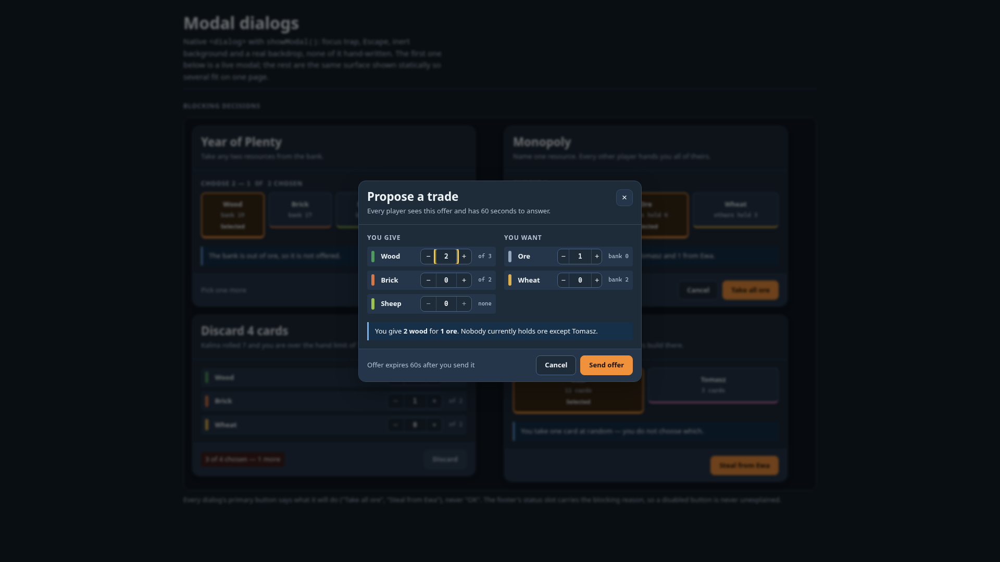
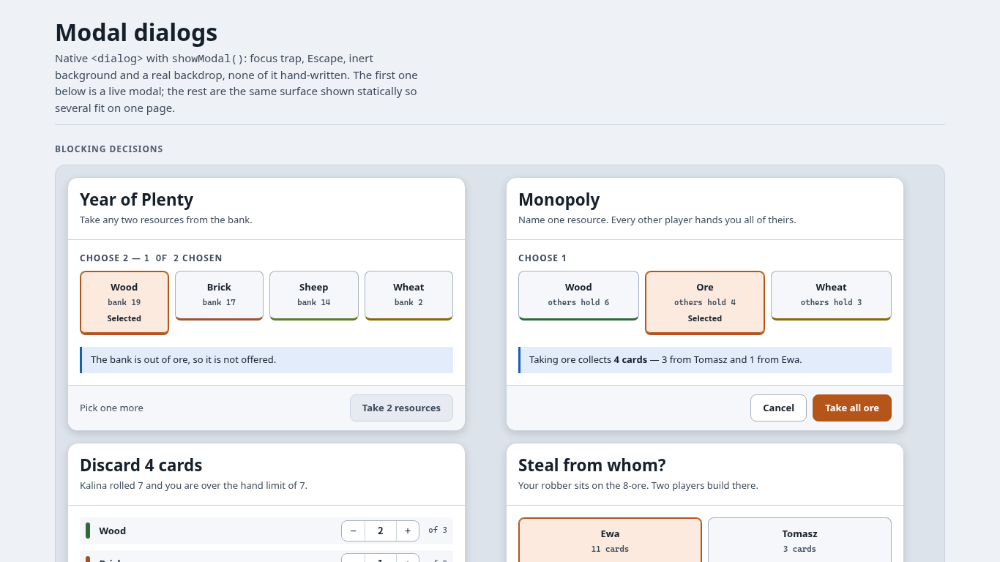
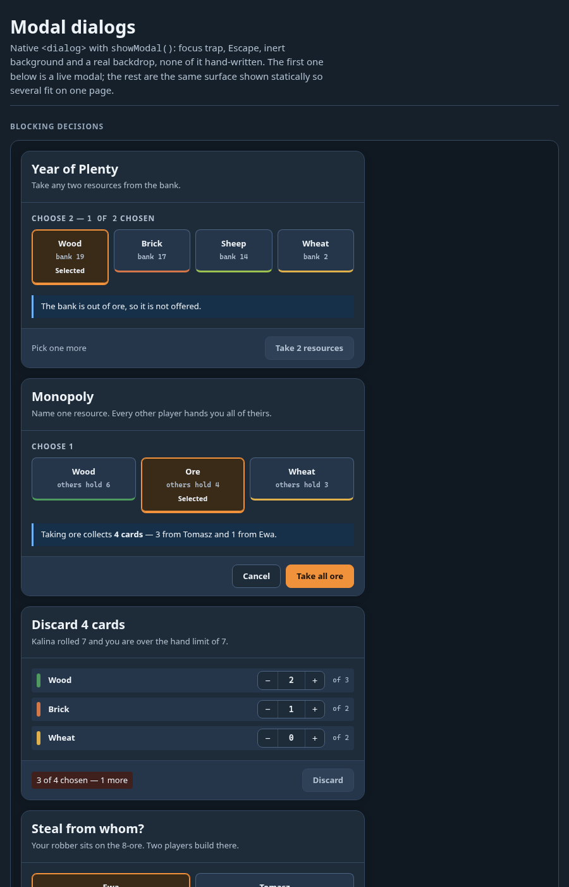

Native `<dialog>` + `showModal()` for the trade form, Year of Plenty, Monopoly,
discard-on-7 and choose-a-victim.

**Use** a modal only for something the game is actually blocked on, or a form
the player deliberately opened. **Do not** use one for an error, for another
player's action, or for anything informational — that belongs in
`banners.html`. An error modal during someone else's turn hides the board the
message is about and steals focus from whatever the player was doing.

`showModal()` gives you a focus trap, inert background, Escape, restored focus
and a real `::backdrop` — all correctly, none of it hand-written. A div with
`position: fixed` gives you a dialog a keyboard user can tab out of behind the
overlay.

```css
dialog {
    max-height: min(90dvh, 44rem);
    overflow: hidden;                 /* body scrolls, footer stays reachable */
}
dialog::backdrop { background: rgb(0 0 0 / .55); backdrop-filter: blur(2px); }
```

Every primary button says what it will do — "Take all ore", "Steal from Ewa",
never "OK" — and the footer's status slot carries the blocking reason, so a
disabled button is never unexplained.

**Caveats:**

- **Put `autofocus` on the first real control.** Without it `showModal()` lands
  focus on the close ×, and the dialog opens looking like it is about to be
  dismissed.
- The demo page opens the live dialog only above 1600px wide, so that one
  screenshot proves the real `<dialog>` + backdrop while the narrower shots show
  the static variants undimmed. That is a demo device, not part of the pattern.
- Choice tiles are real `<input type="radio">`/`checkbox` behind the face, so
  arrow keys work and the group is one tab stop.

---

### 9 · Event log & chat — `patterns/log-and-chat.html`

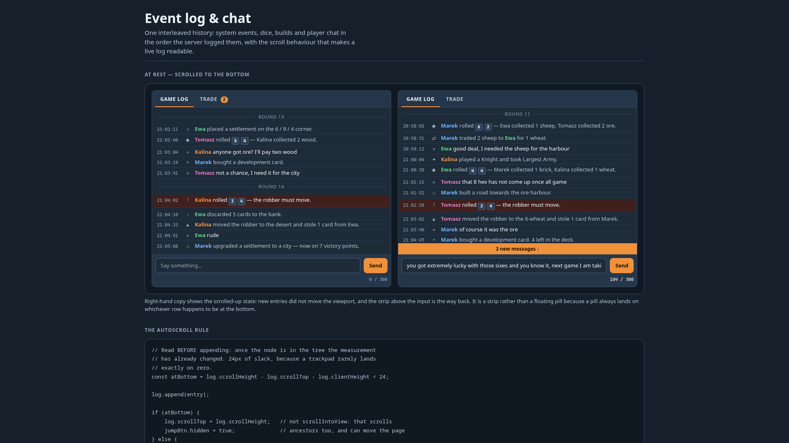
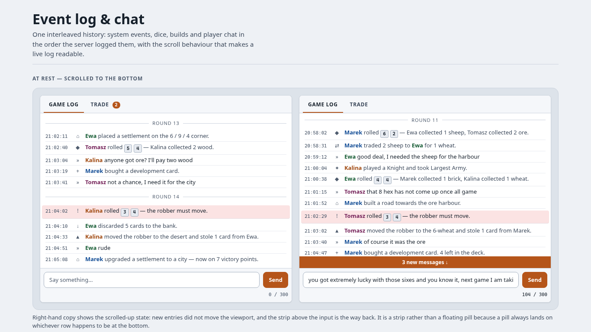
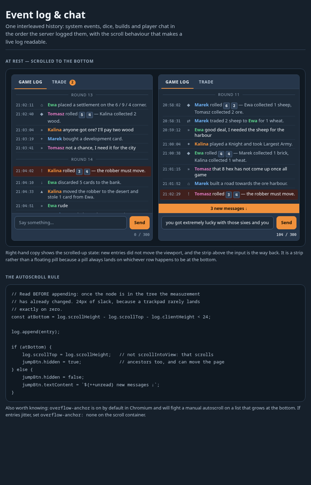

One interleaved history — system events, dice, builds and chat in the order the
server logged them — with the scroll behaviour that makes a live log usable.
The right-hand copy in each screenshot shows the scrolled-up state.

**Use it** as the single history panel. **Do not** split chat and the game log
into two lists: that forces the reader to correlate "Kalina moved the robber"
with "rude" by timestamp, which is the exact work a log exists to save.

```js
// Read BEFORE appending — once the node is in the tree the measurement changed.
const atBottom = log.scrollHeight - log.scrollTop - log.clientHeight < 24;
log.append(entry);
if (atBottom) {
    log.scrollTop = log.scrollHeight;   // not scrollIntoView: that scrolls ancestors
    jumpBtn.hidden = true;
} else {
    jumpBtn.hidden = false;             // never yank the viewport out from under a reader
}
```

```css
/* Pins a short history to the bottom without breaking scroll on a long one.
   justify-content: flex-end would make the top of an overflowing list
   unreachable in every browser. */
.log > :first-child { margin-top: auto; }
```

**Caveats:**

- **The jump-to-latest control is a strip, not a floating pill.** A pill
  positioned `absolute` inside the scroll container resolves against the
  *scrolled content*, so it rode down and sat on top of the newest entry —
  covering the message it was advertising. Reserving space with padding only
  helps when you are already at the bottom, which is the one case where the
  button is hidden. As a full-width strip above the input it covers nothing.
- **Two icons had to be replaced.** The Unicode die face (U+2684) and crossed
  swords (U+2694) rendered as tofu boxes in headless Chromium — the same thing
  a Linux player without a symbol font sees. Everything is now Latin-1, arrows
  or geometric shapes, all present in DejaVu, Liberation and the MS core fonts.
- `overflow-anchor` is on by default in Chromium and fights a manual autoscroll
  on a list that grows at the bottom. If entries jitter, set
  `overflow-anchor: none` on the scroll container.
- `aria-live="polite"` with `aria-relevant="additions"`, so new entries are
  announced and the whole history is not re-read.

---

### 10 · Notices, banners & errors — `patterns/banners.html`

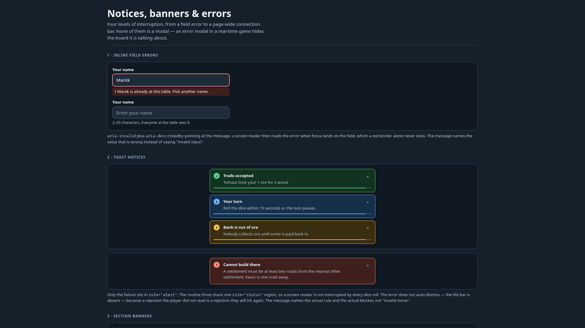
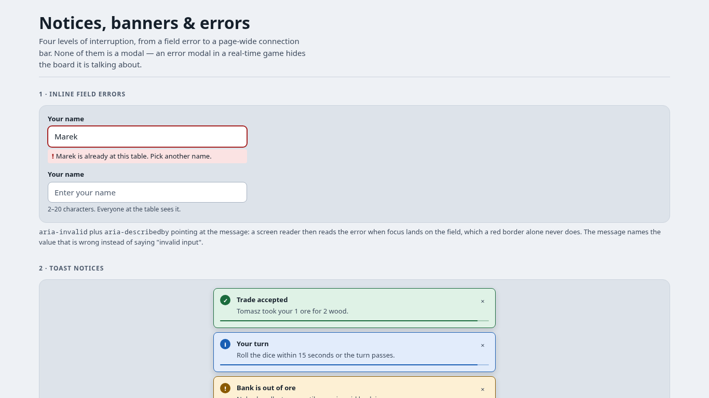
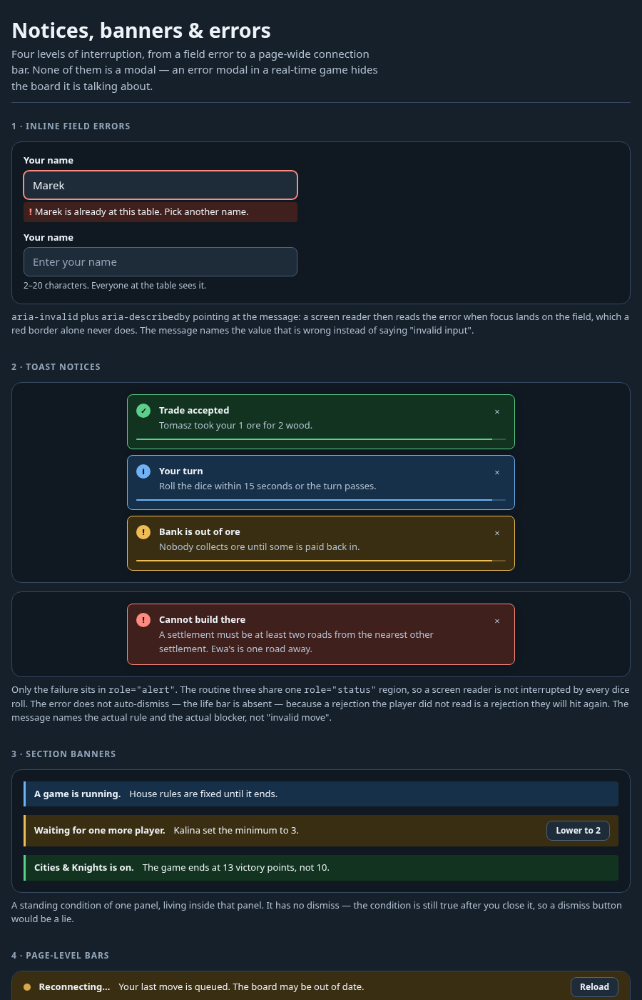

Four levels of interruption: inline field error, toast notice, section banner,
page-level bar. Pick by how much of the player's attention the message deserves.

- **Inline** — a form the player is filling in. `aria-invalid` plus
  `aria-describedby` pointing at the message, so a screen reader reads it when
  focus lands; a red border alone never does that.
- **Toast** — transient, self-dismissing, top-centre, never over the console at
  the bottom of the board. **Do not** auto-dismiss a *failure*: a rejection the
  player did not read is one they will hit again, so the error variant has no
  life bar.
- **Section banner** — a standing condition of one panel ("rules are fixed
  until the game ends"). It has no dismiss, because the condition is still true
  after you close it and a dismiss button would be a lie.
- **Page bar** — the whole app cannot function. It takes its own layout row and
  does *not* overlay, so it never covers the board a worried player is staring
  at.

Live regions: `role="status"` for anything routine, `role="alert"` **only** for
genuine failures. Make every notice assertive and a screen reader interrupts the
reader on every dice roll, and the player turns it off. The region must be in
the DOM before the message is inserted — inserting the container and the text
together announces nothing.

**Caveats:**

- **Give a grid child both coordinates.** `.notice__x` had only `grid-row: 1`
  and auto-placed into column 1, shoving the icon and text right and leading
  every toast with a close ×. Visible instantly in the render, invisible in the
  CSS.
- Messages name the actual rule and the actual blocker ("Ewa's is one road
  away"), not "invalid move".
- The toast life bar doubles as the dismiss timer and is removed entirely under
  `prefers-reduced-motion`, where toasts stay until dismissed.

---

### 11 · Cities & Knights panels — `patterns/cities-knights.html`

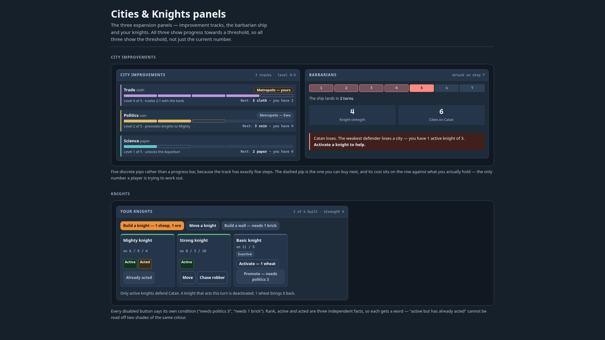
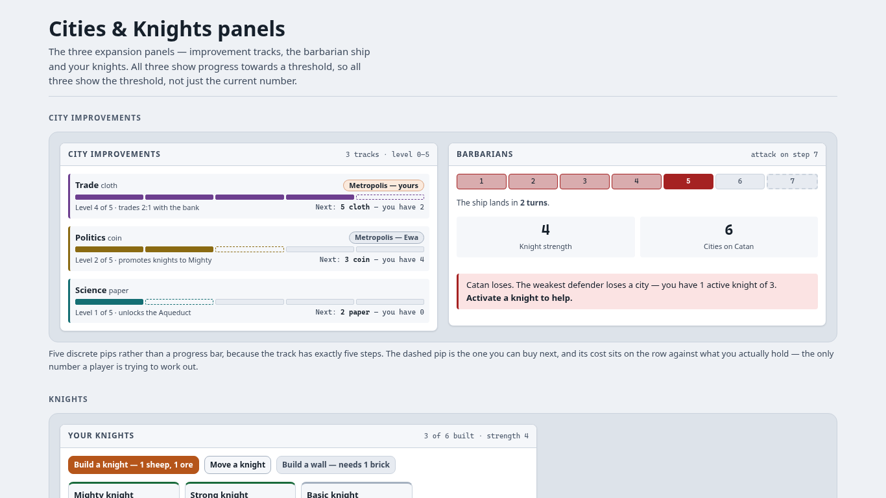
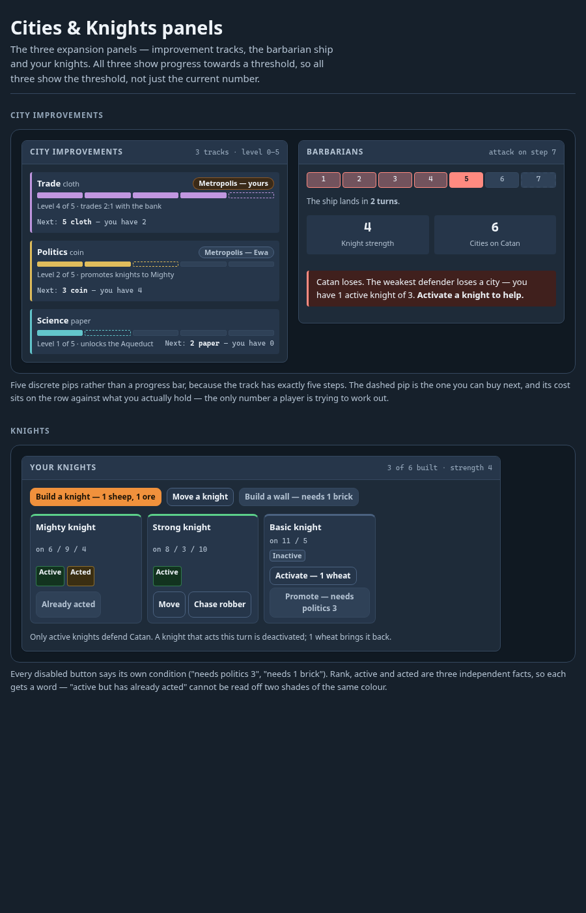

The three improvement tracks, the barbarian ship, and knight cards. All three
show progress towards a threshold, so all three show the threshold.

**Use them** in the rail, each hidden entirely when
`board.cities_knights` is absent. **Do not** show a track as a percentage bar.

- **Improvements** use five discrete pips, because the track has exactly five
  steps and a continuous bar invites the reader to estimate a percentage that
  does not exist. The step you can buy next is outlined, and its cost sits on
  the row against what you actually hold — "5 cloth, you have 2" is the only
  number a player is trying to work out.
- **Barbarians** show knight strength, city count *and* the verdict in words.
  The ship's position alone tells a player nothing about whether they are about
  to lose a city.
- **Knights** carry three independent booleans — rank, active, acted — so each
  gets a word. "Active but has already acted" cannot be read off two shades of
  the same colour.

Every disabled button states its own condition: "Promote — needs politics 3",
"Build a wall — needs 1 brick".

**Caveat:** `--text-faint` on `--surface-3` is 4.13:1 in the dark theme, which
fails AA. The un-reached barbarian step numbers use `--text-muted`. Worth
remembering generally: `--text-faint` is safe on `--surface-1` and on the page
background, not on the darkest chip surface.

---

## What is not verified

Honest gaps, so nobody assumes more coverage than exists:

- **Chromium only.** Everything was rendered in headless Chromium via
  Playwright. Nothing was opened in Firefox or Safari. The features used that
  are most likely to differ: `:has()`, `color-mix()`, `backdrop-filter`,
  `<dialog>` `::backdrop`, `scrollbar-width`/`scrollbar-color`, and
  `-moz-appearance: textfield`. All are Baseline, but "Baseline" is not "I saw
  it".
- **One theme per viewport.** 1920 and 900 are dark, 1366 is light. No pattern
  has been seen at dark-1366 or light-1920. A theme-specific problem at an
  unrendered combination would not have been caught.
- **Static renders only.** Hover, focus-visible, `:active`, the toast life-bar
  animation and the barbarian pulse were written but never screenshotted in
  motion. Focus styling is centralised in `tokens.css` and was not individually
  photographed per component.
- **`prefers-reduced-motion` was not rendered.** The rules are present and
  scoped, but no screenshot was taken with the preference emulated.
- **No real screen-reader test.** ARIA roles, `aria-live`, `aria-pressed`,
  `aria-invalid`/`describedby` and table `scope` are correct by inspection; no
  NVDA/VoiceOver run happened.
- **Contrast over the canvas is approximated.** For Shell B the checker
  composites the 94%-opaque HUD cards against the page background, not against
  the actual painted board underneath. The numbers are close but not exact.
- **The board painter in the shells is a demo.** It draws a plausible 19-hex
  board to make the layout judgeable; it is not `board-renderer.js` and shares
  no code with it. What is real and transferable is the sizing contract — the
  canvas out of flow, the buffer derived from the box, the ResizeObserver.
- **No integration.** No pattern has been dropped into `server/templates/` or
  tested against live socket data, DOM ids, or the client's rendering code.
